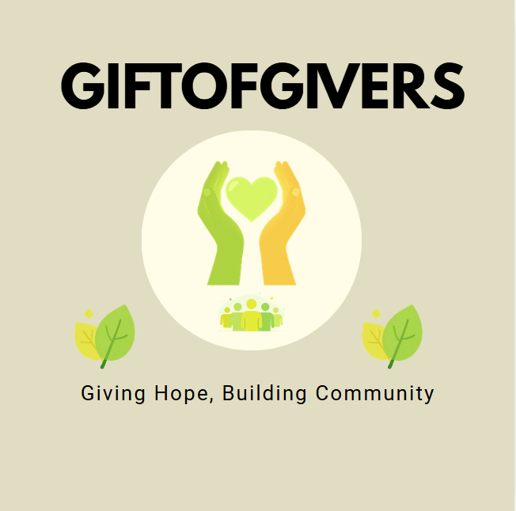

<p align="center">
  
</p>

<h1 align="center">Gift of the Givers Disaster Relief System</h1>

<p align="center">
  ASP.NET Core 8 Razor Pages application for coordinating volunteers, donations, and relief operations.
</p>

<p align="center">
  
  
  
  
  
</p>

<p align="center">
  <a href="https://github.com/OdirileMasemola/GiftOfTheGivers">GitHub</a>
  &nbsp;·&nbsp;
  <a href="https://dev.azure.com/ST10441421/_git/Gift%20of%20the%20Givers%20Disaster%20Relief%20System">Azure Repos</a>
</p>

---

## Overview

Gift of the Givers Disaster Relief System is a web application built for a disaster-relief organisation. It supports a public-facing site for information, donations, and volunteer applications, together with role-aware dashboards for employees, donors, and volunteers.

The system is intended for:

| Audience | Purpose |
| -------- | ------- |
| Public visitors | Learn about the organisation, donate, and apply to volunteer |
| Employees / staff | Review volunteers, manage relief operations, and monitor donations |
| Donors | Record donations and view donor-facing dashboard content |
| Volunteers | Track application status and (where wired) assignment information |

The application persists operational data through Entity Framework Core against SQL Server / Azure SQL, and includes an Azure Functions project for tax certificate generation.

---

## Key Features

Features below are present in the current codebase. Maturity varies by area; see [Project Status](#project-status).

| Area | What exists today |
| ---- | ----------------- |
| Public site | Home, About, Donate, Volunteer application, Login / Register |
| Volunteer applications | Public form creates a `Volunteer` record with status `Pending` and redirects to confirmation |
| Volunteer management | Employee list with Approve / Reject / Activate / Deactivate status actions and summary counts |
| Relief operations | Employee operations dashboard with create and status updates |
| Donations | Public donation form; employee donations list with completed-amount summaries |
| Tax certificates | Created from the web app on donate; also generated via Azure Function with idempotent behaviour |
| Dashboards | Employee, Operations, Volunteers, Donations, Donor, Volunteer, Settings |
| Authentication | Custom cookie authentication with role claims |
| Password hashing | PBKDF2 (SHA-256, 10,000 iterations) in `SeedData` |
| Seeding | Demo users and sample data via `SeedData.Initialize` on startup |
| Deployment | GitHub Actions builds and deploys the web app to Azure App Service on pushes to `master` |

---

## User Roles

Roles are stored on the `User.Role` string and issued as a cookie claim at login. Seeded demo accounts use the values below.

| Role | How it is used in the app |
| ---- | ------------------------- |
| Employee | Staff dashboards (Employee, Operations, Volunteers, Donations). Seeded as `employee@test.local`. |
| Donor | Donor dashboard path and registration default. Seeded as `donor@test.local`. Public volunteer signup currently also creates users with this role in code. |
| Volunteer (data) | Volunteer status and records live primarily on the `Volunteer` entity (`Pending` / `Approved` / `Active` / `Rejected`). The seed user `volunteer@test.local` is stored with Role `Donor` so the account can also donate. |
| Administrator | Not seeded and not used as a distinct role in the current sidebar / seed data. |

Anonymous visitors can use public pages (Home, About, Donate, Volunteer, Login, Register).

---

## Technology Stack

| Technology | Version / detail | Purpose |
| ---------- | ---------------- | ------- |
| C# / .NET | `net8.0` | Application runtime |
| ASP.NET Core | Razor Pages | Web UI and request handling |
| Entity Framework Core | 8.0.30 (SQL Server provider) | ORM and migrations tooling |
| SQL Server / Azure SQL | via `ConnectionStrings:DefaultConnection` | Persistent store |
| Cookie authentication | Custom scheme `"Cookies"` | Sign-in sessions and claims |
| Azure App Service | App name `Gift-of-the-givers-prototype` | Hosted web deployment |
| Azure Functions | v4, isolated worker (`net8.0`) | Tax certificate HTTP function |
| Application Insights packages | Present on Functions project | Telemetry support for Functions |
| GitHub | [OdirileMasemola/GiftOfTheGivers](https://github.com/OdirileMasemola/GiftOfTheGivers) | Source control and Actions CI/CD |
| Azure Repos | [Gift of the Givers Disaster Relief System](https://dev.azure.com/ST10441421/_git/Gift%20of%20the%20Givers%20Disaster%20Relief%20System) | Collaborative source control remote |
| GitHub Actions | `.github/workflows/master_gift-of-the-givers-prototype.yml` | Build + deploy on `master` |

Front end: Razor (`.cshtml`), CSS under `wwwroot/css`, and JavaScript under `wwwroot/js`.

---

## System Architecture

The solution is a **Razor Pages** web application. PageModels talk to **`ApplicationDbContext`** directly (there is no separate repository/service layer in the current code). Domain types are defined alongside the context in `Data/ApplicationDbContext.cs`.

```text
Browser
  |
  v
ASP.NET Core 8 Razor Pages  (Pages/*, PageModels)
  |-- Cookie authentication + role claims
  |-- EF Core 8  -->  SQL Server / Azure SQL
  |
  +-- Nested Azure Functions project
        GenerateTaxCertificate (HTTP)
          --> same ApplicationDbContext / SQL database
```

Startup (`Program.cs`) registers EF Core, cookie authentication, authorization services, Razor Pages, and runs `SeedData.Initialize` during application start.

The Functions project references the web project so it can reuse EF models and the database context.

---

## Project Structure

Repository root *is* the web project (not a nested `src/` layout):

```text
GiftOfTheGivers/
├── Pages/
│   ├── Index, About, Donate, Volunteer, VolunteerConfirmation
│   ├── Login, Logout, AccessDenied
│   ├── Dashboards/          # Employee, Operations, Volunteers, Volunteer,
│   │                        # Donations, Donor, Settings
│   └── Shared/              # Layout, navigation, footer, sidebar
├── Areas/Identity/          # Register (and related) pages — custom Users table path
├── Data/
│   ├── ApplicationDbContext.cs   # DbContext + entity classes
│   ├── SeedData.cs               # Demo users, hashing, sample data
│   └── Migrations/
├── GiftOfTheGivers.Functions/
│   ├── GenerateTaxCertificate.cs
│   ├── Program.cs
│   ├── host.json
│   └── local.settings.json       # Local only — do not commit secrets
├── wwwroot/
│   ├── css/     # site, pages, dashboard, navbar
│   ├── js/
│   └── images/  # logo.PNG, hero-relief.jpg
├── Program.cs
├── GiftOfTheGivers.csproj
├── GiftOfTheGivers.slnx
├── appsettings.json
├── LICENSE.txt
└── README.md
```

---

## Database

EF Core maps the following entities (commented in code as the domain table set):

| Entity | Role |
| ------ | ---- |
| `User` | Accounts (name, email, password hash, phone, role) |
| `Donation` | Donation amounts, currency, date, payment status, reference |
| `Volunteer` | Linked to `User`; skills, availability, registration date, status |
| `ReliefRequest` | Incoming relief needs |
| `ReliefOperation` | Operations planned/active against requests |
| `DonationAllocation` | Links donations to relief operations |
| `DonationSchedule` | Recurring donation schedules |
| `TaxCertificate` | Certificate metadata for a donation |
| `AuditLog` | Audit entries |
| `VolunteerAssignment` | Links volunteers to relief operations (`AssignedDate`) |

High-level relationships:

- `User` 1—* `Donation`, `Volunteer`
- `Volunteer` 1—* `VolunteerAssignment` *—1 `ReliefOperation`
- `Donation` 1—* `TaxCertificate`, `DonationAllocation`
- `ReliefRequest` 1—* `ReliefOperation`

**Secrets:** connection strings belong in User Secrets, Azure App Settings, or local untracked config — never in this README or in committed source.

Startup seeding currently uses `EnsureCreatedAsync()` inside `SeedData` (in addition to migration files under `Data/Migrations`). Treat migrations and the live model as something to keep aligned when changing schema.

---

## Azure Infrastructure and Deployment

| Service | Responsibility in this project |
| ------- | ------------------------------ |
| Azure App Service | Hosts the ASP.NET Core web app (`Gift-of-the-givers-prototype`) |
| Azure SQL / SQL Server | Application database via EF Core |
| Azure Functions | HTTP endpoint for tax certificate generation |
| GitHub Actions | CI build (`dotnet` 8.x) and deploy to App Service on push to `master` |
| Azure Repos | Additional Git remote for team collaboration |

Workflow file: `.github/workflows/master_gift-of-the-givers-prototype.yml`.

Deployment credentials are supplied through GitHub Actions secrets (OIDC / Azure login). Do not copy secret values into documentation or source control.

---

## Azure Function: GenerateTaxCertificate

Project: `GiftOfTheGivers.Functions` (Azure Functions v4, isolated worker).

| Item | Detail |
| ---- | ------ |
| Function name | `GenerateTaxCertificate` |
| Trigger | HTTP GET/POST |
| Route | `GenerateTaxCertificate/{donationId?}` (or `donationId` query string) |
| Auth level | Function key (`AuthorizationLevel.Function`) |

Behaviour (from implementation):

1. Requires a valid positive `donationId`.
2. Loads the donation; returns not found if missing.
3. Requires `PaymentStatus` of `Completed`.
4. If a `TaxCertificate` already exists for that donation, returns success with `alreadyExisted: true` (idempotent — no duplicate insert).
5. Otherwise creates a certificate record and returns the result.

The web Donate page can also create tax certificate rows when recording a donation. Prefer treating the Function as the dedicated generation/retrieval path when integrating clients, and avoid inventing a second numbering scheme.

---

## Authentication and Security

| Topic | Current implementation |
| ----- | ---------------------- |
| Mechanism | Custom cookie authentication scheme `"Cookies"` in `Program.cs` |
| Login | Email + password verified with `SeedData.VerifyPassword`; claims include name identifier, email, name, and role |
| Register | Creates a `User` with hashed password (default role `Donor`) |
| Password hashing | PBKDF2 via `Rfc2898DeriveBytes` (SHA-256, 10,000 iterations, random salt) |
| Authorization | Cookie auth + role checks in UI (e.g. Employee dashboard link). Strengthen page-level `[Authorize]` as part of ongoing work |
| Configuration | `UserSecretsId` on the web project; connection string via configuration |
| Identity UI | `Areas/Identity` still contains pages such as Register; the live sign-in path is the custom cookie flow, not ASP.NET Core Identity `UserManager` |

Never commit:

- Connection strings with credentials
- `local.settings.json` secrets
- API keys, passwords, certificates
- `.env` files containing secrets

---

## Getting Started

### Prerequisites

- [.NET 8 SDK](https://dotnet.microsoft.com/download/dotnet/8.0)
- SQL Server, LocalDB, or an Azure SQL database
- Visual Studio 2022 / VS Code / Rider (optional)
- [Azure Functions Core Tools](https://learn.microsoft.com/azure/azure-functions/functions-run-local) (optional, for the Functions project)

### Clone

```bash
git clone https://github.com/OdirileMasemola/GiftOfTheGivers.git
cd GiftOfTheGivers
```

Azure Repos remote (if used by your team):

```bash
git remote add azure https://dev.azure.com/ST10441421/_git/Gift%20of%20the%20Givers%20Disaster%20Relief%20System
```

### Configuration

Set the SQL connection string without committing secrets.

**User Secrets (recommended for local web app):**

```bash
dotnet user-secrets set "ConnectionStrings:DefaultConnection" "YOUR_CONNECTION_STRING"
```

Or place a local value in `appsettings.Development.json` (keep secrets out of Git).

For Functions, use `GiftOfTheGivers.Functions/local.settings.json` locally (Values such as connection strings). Keep that file out of commits when it contains secrets.

### Database

1. Ensure SQL Server / Azure SQL is reachable.
2. Configure `ConnectionStrings:DefaultConnection`.
3. Run the web app once so `SeedData.Initialize` can create/seed data as implemented (uses `EnsureCreatedAsync`).
4. For schema evolution, prefer EF migrations aligned with `ApplicationDbContext` rather than drifting from the snapshot.

### Run the web application

```bash
dotnet restore
dotnet build
dotnet run
```

Open the HTTPS URL printed by Kestrel (or use the IIS Express / launch profile in Visual Studio).

Demo accounts are created by seed data when seeding succeeds (see `Data/SeedData.cs`), including employee and donor test emails. Change default passwords for any shared or deployed environment.

### Run the Azure Function (optional)

```bash
cd GiftOfTheGivers.Functions
func start
```

Call the HTTP trigger with a valid `donationId` for a completed donation (function key required when authorized at Function level).

---

## Development Workflow

Default branch: **`master`**.

Agreed feature branches for collaborative work:

```text
master
  |
  +-- feature/volunteer-application
  +-- feature/volunteer-management
  +-- feature/volunteer-dashboard
  +-- feature/donation-improvements
  +-- feature/employee-donations-reporting
```

Typical flow:

1. Update `master` (`git pull`).
2. Create your feature branch from `master`.
3. Implement only the scoped work for your issue.
4. Commit with meaningful messages.
5. Build and test locally.
6. Push the branch (GitHub and/or Azure Repos).
7. Open a Pull Request targeting `master`.
8. Reference the related GitHub issue.
9. Review, test, merge, then delete the feature branch if appropriate.

Do not use dummy commits for evidence. Do not force-push shared branches.

---

## Testing

There is **no dedicated automated test project** in the repository at present.

Quality checks in use:

| Approach | Notes |
| -------- | ----- |
| `dotnet build` | Local and in GitHub Actions |
| Manual UI testing | Public pages, dashboards, login, donate, volunteer flows |
| Functions manual calls | HTTP trigger against completed donations |
| GitHub Actions | Build + publish + Azure Web App deploy on `master` |

When adding features, include practical manual test steps in the related GitHub issue / PR.

---

## Project Status

### Implemented

- Public Home, About, Donate, Volunteer application, confirmation page
- Custom cookie login / logout / register path and PBKDF2 hashing
- Employee dashboards for overview, operations, volunteers (status workflow), and donations listing
- EF Core domain model for users, donations, volunteers, relief, allocations, schedules, tax certificates, audit logs, assignments
- Nested Azure Function for tax certificate generation (idempotent)
- GitHub Actions deploy to Azure App Service
- MIT license

### In progress / improving

Tracked in GitHub issues for a five-developer split, including:

- [#5](https://github.com/OdirileMasemola/GiftOfTheGivers/issues/5) Volunteer application and confirmation
- [#7](https://github.com/OdirileMasemola/GiftOfTheGivers/issues/7) Volunteer management and assignments
- [#8](https://github.com/OdirileMasemola/GiftOfTheGivers/issues/8) Volunteer dashboard (replace prototype content)
- [#6](https://github.com/OdirileMasemola/GiftOfTheGivers/issues/6) Donations and donor experience
- [#9](https://github.com/OdirileMasemola/GiftOfTheGivers/issues/9) Employee donation management and reporting

### Known gaps (honest)

- Donor and Volunteer dashboards still contain prototype / hardcoded presentation in places
- `VolunteerAssignment` exists in the model but is not fully exposed in UI workflows yet
- Some management pages need stronger authorization hardening and UI polish (search, filters, feedback)
- Prefer aligning EF migrations with the live domain model over long-term reliance on `EnsureCreated` alone

---

## Contribution

This repository is developed by a small team using issue-scoped feature branches and pull requests.

1. Pick an issue and its branch name.
2. Branch from latest `master`.
3. Keep changes inside the issue scope to reduce merge conflicts.
4. Build, manually test, and push.
5. Open a PR to `master` that references the issue.

Shared conflict hotspots to coordinate on: `Program.cs`, `Pages/Shared/_DashboardSidebar.cshtml`, and `wwwroot/css/dashboard.css`.

---

## Security and Secrets

- Never commit passwords, connection strings, API keys, Azure credentials, or function keys.
- Prefer User Secrets and Azure App Settings.
- Keep `local.settings.json` and secret-bearing `.env` files out of Git when they contain credentials.
- Review `.gitignore` before committing.

---

## License

This project is released under the MIT License. See [`LICENSE.txt`](LICENSE.txt).

Copyright (c) 2026 Odirile Masemola.

Suitable for academic portfolio / PoE submission and professional demonstration of an ASP.NET Core disaster-relief prototype.

---

## Links

| Resource | URL |
| -------- | --- |
| GitHub repository | https://github.com/OdirileMasemola/GiftOfTheGivers |
| Azure Repos | https://dev.azure.com/ST10441421/_git/Gift%20of%20the%20Givers%20Disaster%20Relief%20System |
| License | [LICENSE.txt](LICENSE.txt) |
